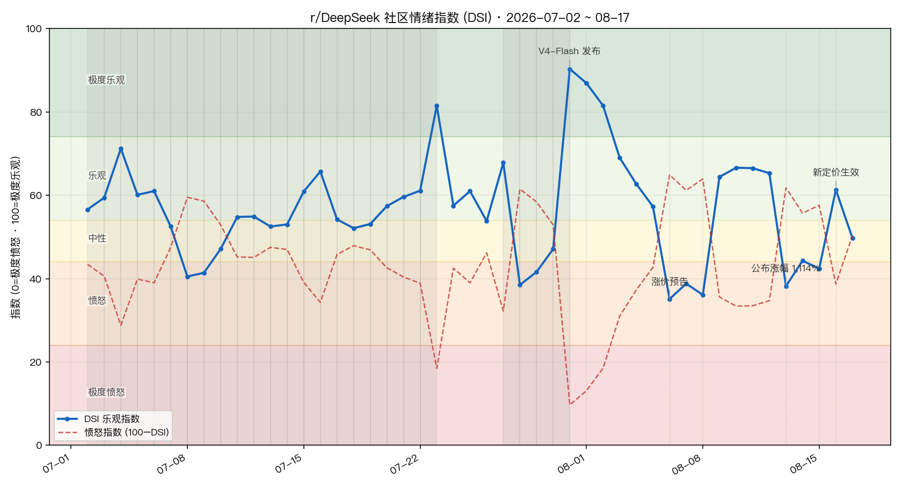

# DeepSeekHarness-community-index

**DeepSeekHarness-community-index** — a web plugin for DeepSeek Harness (DSH).

> [中文文档](./README.zh.md)

Registers a "Sentiment Cockpit" section in the settings panel that shows a live **DSI optimism/anger index** for the r/DeepSeek community (a 0–100 multi-signal weighted structure modeled after the Crypto Fear & Greed Index), backed by a data pipeline that refreshes on a schedule (every 60 minutes by default). When the pipeline fails it falls back to a bundled snapshot — **the panel never goes blank**.

[](./LICENSE)
[](https://github.com/deepseek-ai/deepseek-harness)

## Screenshot



## Features

- **Settings panel section**: Settings → Sentiment Cockpit. DSI index, anger index, and last-update time at a glance, with manual refresh and "open in new tab".
- **Desktop widget (macOS)**: a native borderless floating window that lives on your desktop, shows the DSI index in real time, and follows the pipeline automatically. Draggable and scalable; supports two window levels — "desktop" (sticks to the desktop layer, ordinary windows cover it, like a classic desktop widget) and "floating" (always on top). It boots as a small **📈 mini pill** by default and expands to the full dashboard only when clicked. Powered by a bundled native binary (`assets/desktop/`, source `main.swift`) — no Electron, no extra dependencies.
- **Auto refresh**: the Host drives a Python data pipeline on a timer (Arctic Shift mirror API → index computation → self-contained HTML snapshot), every 60 minutes by default.
- **Never a blank screen**: falls back to the bundled snapshot (`assets/fallback/`) when the pipeline fails or the cache is corrupt.
- **Zero build authorization**: plain JavaScript, no build scripts — installing from Git requires no `allowBuilds` approval.

## Installation

Recommended: install from this Git repository.

```bash
dsh plugin --profile web add github:RiRi9909/DeepSeek-Community-Index
```

> Pin a commit to keep later pushes from changing what you actually run:
> `dsh plugin --profile web add github:RiRi9909/DeepSeek-Community-Index#<commit-sha>`

Other options (see the [official publishing docs](https://github.com/deepseek-ai/deepseek-harness/blob/master/docs/user/develop/basic/publish.zh.md)):

```bash
# local path
dsh plugin --profile web add /path/to/dsh-sentiment-cockpit

# tarball (built with pnpm pack)
dsh plugin --profile web add ./dsh-sentiment-cockpit-0.2.2.tgz
```

Restart DSH after installing. The plugin then shows up under Settings → Plugins, and the "Sentiment Cockpit" section appears in the settings panel.

## Usage

- Open **Settings → Sentiment Cockpit** for the panel; it polls for new data every 60 seconds.
- Click **Refresh** to re-run the pipeline immediately (about 1–20 minutes; the button shows "Refreshing…" meanwhile).
- Click **Open in new tab** to view the self-contained HTML snapshot standalone.
- Settings namespace `sentiment-cockpit`: `enabled` (default `true`), `intervalMinutes` (default `60`, range 10–1440).

### Desktop widget

Configured in the `sentiment-cockpit` settings namespace:

| Key | Default | Description |
| --- | --- | --- |
| `desktopEnabled` | `false` | Open the desktop widget when DSH starts |
| `desktopMode` | `"desktop"` | `"desktop"` sticks to the desktop layer (normal windows cover it); `"floating"` keeps it on top |
| `desktopScale` | `1` | Scale (0.7–1.6) |
| `desktopX` / `desktopY` | `-1` | Window position; negative values auto-place it at the bottom-right |

Changes take effect after restarting DSH. The widget has two states and **always boots in the mini state**:

- **Mini state**: a small pill showing 📈 + the DSI value (parked at the bottom-right corner by default). Click the pill to expand the full card; drag the pill to move it.
- **Full state**: the header shows the live DSI index and offers four actions — minimize (—), refresh (⟳), open snapshot in browser (⧉), close (✕). Drag the header to move the window.

Positions of both states are remembered and restored across restarts (each boot still starts from the mini state).

If the bundled binary is missing (e.g. a non-arm64 Mac), the plugin attempts to compile `assets/desktop/main.swift` on the fly with the local `swiftc`.

## Dependency contract

- **Host**: `@deepseek-ai/cordis`, `@deepseek-ai/dsh-settings`, `@deepseek-ai/dsh-typert-protocol`, `schemastery` (resolved through the profile's shared `node_modules`).
- **Client**: `react` (shared module loader), `dsh-client-runtime` / `dsh-client-connection` / `dsh-client-locale` / `dsh-client-ui-slots` (declared in `dsh.client.inject`). The client calls the Host's Typert gateway SRC channel directly via `ctx.connection.rpc.call("/api", "cockpit/<method>", …)`.
- **Pipeline**: system `python3` (standard library only, no third-party packages).

## Architecture

| Part | Files | Responsibility |
| --- | --- | --- |
| Host | `lib/index.js` | Cordis plugin exposing Typert RPC `remote.cockpit` (`getSnapshot` / `refresh` / `status`), drives the pipeline on a timer, manages the desktop widget process |
| Client | `lib/client.js` | Registers the `settings.section` slot, renders the snapshot in an iframe srcDoc |
| Desktop widget | `assets/desktop/main.swift` (+ prebuilt `DSHCockpitWidget`) | Native macOS floating window that renders the snapshot and auto-refreshes |
| Pipeline | `lib/pipeline/` | `fetch_posts.py` → `fetch_comments.py` → `sentiment_index.py` → `build_snapshot.py` (orchestrated by `run_pipeline.py`) |
| Fallback | `assets/fallback/` | Bundled snapshot used when the cache at `~/.dsh/storages/dsh-sentiment-cockpit/` is unavailable |

## Updating the snapshot manually

```bash
python3 lib/pipeline/run_pipeline.py --out ~/.dsh/storages/dsh-sentiment-cockpit
```

## FAQ

- **Panel says "remote.cockpit unavailable: host plugin not loaded"**: restart DSH (the Host plugin needs to re-boot).
- **Data hasn't changed in a while**: check that `python3` is installed; run the pipeline command above manually to see the error.
- **Turn off auto-refresh**: set `enabled` to `false` in the `sentiment-cockpit` settings namespace.

## License

[MIT](./LICENSE) © 2026 RiRi9909
